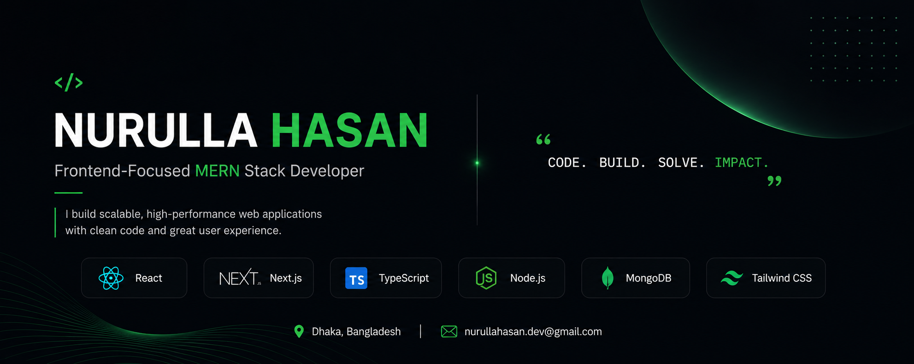

<!-- Banner: Keep banner3.png inside your GitHub profile repository -->

  

# Hi 👋, I'm Nurulla Hasan

### Full-Stack Web Developer

 

---

## 👨‍💻 About Me

- 👋 Hi, I'm **[Nurulla Hasan](https://github.com/nurulla-hasan)**.

- 💻 I'm a **Full-Stack Web Developer** with 1+ year of professional experience.

- 🏢 Currently working as a **Frontend Developer at Betopia Group**.

- 🎨 Using **React, Next.js, TypeScript, Tailwind CSS, Zustand, and TanStack Query** for frontend development.

- ⚙️ Working with **Node.js, Express.js, MongoDB, PostgreSQL, Prisma ORM, and REST APIs** for backend development.

- 🎓 Currently continuing the **Programming Hero Next Level Web Development Program**.

- 🌱 Recently completed **PostgreSQL and Prisma ORM**.

- 🗺️ Building **Mouza Map Pro** and a **Mess Management System**.

- 💬 Ask me about **React, Next.js, TypeScript, Node.js, PostgreSQL, Prisma, and MongoDB**.

- 🌐 Explore my **[Portfolio](https://nurulla-hasan-portfolio-pink.vercel.app/)** and **[Resume](./resume.pdf)**.

- 🔗 Connect with me on **[LinkedIn](https://www.linkedin.com/in/nurulla-hasan/)**.

- 📫 Reach me via **[Email](mailto:nurullahasan.dev@gmail.com)**.
---

## 🛠️ Technology Stack

### 💻 Languages

  
  
  
  

### 🎨 Frontend Development

  
  
  
  

`React.js` `Next.js App Router` `TypeScript` `Tailwind CSS` `shadcn/ui` `Framer Motion` `Konva.js`

### 🗃️ State Management, Forms & Data

`Zustand` `Redux Toolkit` `TanStack Query` `TanStack Table` `React Hook Form` `Zod`

### ⚙️ Backend Development

  
  

`Node.js` `Express.js` `REST APIs` `JWT Authentication` `Role-Based Access Control`

### 🗄️ Database & ORM

  
  
  

`PostgreSQL` `Prisma ORM` `MongoDB` `Mongoose`

### 🔧 Tools & Platforms

  
  
  
  
  
  

---

## 🚀 What I Build

- Production-ready SaaS applications
- Full-stack dashboard applications
- Role-based authentication systems
- API-integrated CRUD workflows
- Complex data tables and filtering systems
- Reusable custom hooks and utilities
- SEO-friendly corporate websites
- Automated billing and reporting systems
- Interactive canvas and geospatial tools
- Responsive and accessible user interfaces

---

## 🌟 Featured Projects

<table>
  <tr>
    <td width="50%" valign="top">

### 🗺️ Mouza Map Pro

A high-performance geospatial plotting and land measurement platform built with React and Konva.js.

**Key Features**

- Interactive 2D land plotting
- Land area calculation
- Polygon splitting and measurement
- Intelligent label positioning
- Scale-accurate A4 PDF reports
- Client-side PDF processing
- Reusable Zustand store architecture

**Technology**

`React` `TypeScript` `Konva.js` `Zustand` `jsPDF`

 

</td>

<td width="50%" valign="top">

### 🍽️ Mess Management System

A full-stack SaaS platform for managing meals, members, billing, expenses, and utility distribution.

**Key Features**

- Role-based dashboards
- Automated monthly billing
- Dynamic meal-rate calculation
- Expense and utility management
- AI-assisted menu planning
- Market scheduling
- Reports and payment workflows

**Technology**

`Next.js` `TypeScript` `Express.js` `MongoDB`

 

</td>
  </tr>

  <tr>
    <td width="50%" valign="top">

### ⚖️ MentorIP Law Firm

A high-performance corporate website focused on SEO, content navigation, and optimized rendering.

**Key Features**

- Advanced JSON-LD structured data
- Dynamic HTML Table of Contents
- Global command palette
- On-Demand ISR
- Optimized content caching
- Responsive and accessible UI

**Technology**

`Next.js` `TypeScript` `Tailwind CSS` `shadcn/ui`

 

</td>

<td width="50%" valign="top">

### 💍 Wedding Marketplace

A vendor marketplace with advanced discovery, comparison workflows, and separate user and vendor dashboards.

**Key Features**

- Advanced vendor filtering
- Vendor comparison workflows
- User and vendor dashboards
- API-integrated application flows
- Reusable frontend architecture
- Responsive marketplace experience

**Technology**

`Next.js` `TypeScript` `Tailwind CSS`

 

</td>
  </tr>
</table>

---

## 🧩 Developer Highlights

<table>
  <tr>
    <td width="50%" valign="top">

### 🔍 useNextFilter

A reusable custom hook for managing URL-driven filters in Next.js App Router applications.

- Debounced search
- Sorting and pagination
- Multi-select filters
- Batch query updates
- Push and replace navigation
- Type-safe filter keys
- Automatic pagination reset

</td>

<td width="50%" valign="top">

### 🌐 nextServerFetch

A centralized server-side API fetching layer for scalable Next.js applications.

- Automated JWT validation
- Refresh-token handling
- Standardized request configuration
- Next.js caching support
- Cache tags and revalidation
- Consistent error handling
- Server-side authentication support

</td>
  </tr>
</table>

---

## 📊 GitHub Statistics & Analytics

  

  

---

## 📈 Contribution Activity

---

## 🤝 Connect With Me

---

### 💭 Development Philosophy

> **Building scalable, production-ready web applications with clean architecture and meaningful user experiences.**

 

