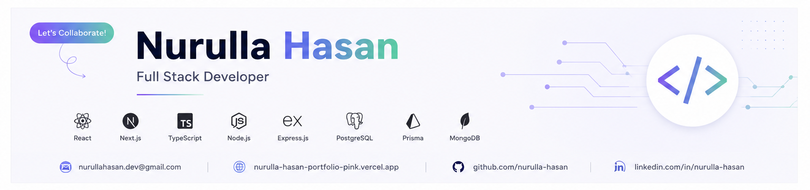

# Hi, I'm Nurulla Hasan 👋

  
  
  
  

## About Me

- Frontend-focused developer with full-stack capability and over one year of professional experience.
- Currently working as a **Junior Frontend Developer at Sparktech Agency**.
- Building responsive, maintainable products with **React, Next.js, TypeScript, Tailwind CSS, Zustand, Redux Toolkit, and TanStack Query**.
- Comfortable developing backend APIs with **Node.js, Express.js, PostgreSQL, Prisma ORM, and MongoDB**.
- Interested in reusable architecture, complex UI workflows, performance, accessibility, and practical product development.

## Featured Projects

### 🗺️ Mouza Map Pro

A browser-based land mapping toolkit for plotting, measurement, map tracing, alignment, cleanup, annotation, and export workflows.

**Highlights**

- Interactive land plotting and area measurement
- Tracer, pantagraph, and map-alignment workflows
- Canvas-based editing with desktop and mobile interactions
- PDF, sheet, and KMZ-oriented export workflows
- Reusable React, TypeScript, Zustand, and Konva.js architecture

**Stack:** `React` `TypeScript` `Konva.js` `Zustand` `jsPDF`

---

### 🍽️ Mess OS

A full-stack mess management platform for managing meals, members, shopping, expenses, utilities, billing, reports, and role-based operations.

**Highlights**

- Separate role-based dashboards and workflows
- Automated monthly billing and dynamic meal-rate calculation
- Expense, utility, market, and payment management
- AI-assisted shopping workflows
- Reporting and operational management tools

**Stack:** `Next.js` `TypeScript` `Express.js` `MongoDB`

---

### ⚖️ MentorIP Law Firm

A production corporate website focused on SEO, structured content, navigation, and efficient rendering.

**Highlights**

- JSON-LD structured data
- Dynamic HTML table of contents
- Global command palette
- On-demand ISR and content caching
- Responsive and accessible user interface

**Stack:** `Next.js` `TypeScript` `Tailwind CSS` `shadcn/ui`

---

### 💍 Elevator — Wedding Marketplace

A wedding vendor marketplace with discovery, comparison, and separate user and vendor experiences.

**Highlights**

- Advanced vendor filtering and comparison
- User and vendor dashboards
- API-integrated application workflows
- Reusable frontend components and state flows
- Responsive marketplace experience

**Stack:** `Next.js` `TypeScript` `Tailwind CSS`

## Developer Highlights

### 🔍 useNextFilter

A reusable, type-safe hook for managing URL-driven filters in Next.js App Router applications.

- Debounced search
- Sorting, pagination, and multi-select filters
- Batch query updates
- Push and replace navigation
- Automatic pagination reset
- Typed filter keys and helper methods

### 🌐 nextServerFetch

A server-only API request utility for consistent data fetching in Next.js applications.

- Required, optional, and unauthenticated request modes
- Cookie-based access-token handling
- Standardized headers and request configuration
- Safe JSON response parsing
- Consistent API error handling
- Support for common request body types

## Tech Stack

**Frontend:** `JavaScript` `TypeScript` `React` `Next.js` `Tailwind CSS` `Redux Toolkit` `Zustand` `TanStack Query` `React Hook Form` `Zod`

**Backend:** `Node.js` `Express.js` `REST APIs` `JWT` `PostgreSQL` `Prisma ORM` `MongoDB`

**Tools:** `Git` `GitHub` `Vercel` `Postman` `Figma` `VS Code`

## Contribution Activity

---

**Frontend Developer · Full-Stack Capable · Building practical web products**

