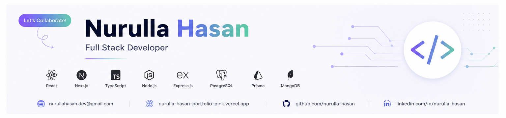

# Hi, I'm Nurulla Hasan 👋

  
  
  
  

## 👨‍💻 About Me

- 💼 Frontend Developer with **1+ years of professional experience**
- 🏢 Working as a **Junior Frontend Developer at Sparktech Agency**
- ⚛️ Specialized in **React.js, Next.js, TypeScript, and Tailwind CSS**
- 🧩 Building production websites, role-based dashboards, and reusable frontend systems
- 🗺️ Currently developing **Mouza Map Pro V2**
- 🚀 Following **Programming Hero's Next Level Batch 7** to grow into an AI-driven full-stack developer

## 🎓 Learning Journey

- 🎯 Currently working professionally in **frontend engineering**
- 🧱 Advancing through **TypeScript, Node.js, Express.js, PostgreSQL, Prisma, Next.js, API design, and system architecture**
- 🐳 Expanding into deployment and infrastructure concepts including **Docker and Nginx**
- 🤖 Progressing toward practical **AI and LLM integrations, semantic search, RAG, and AI-powered product development**

## 🛠️ Skills & Tools

<strong>Frontend Development</strong>

 

  

<strong>Backend, Data & AI</strong>

 

  

<strong>Development Tools</strong>

## 🚀 Featured Projects

### 🗺️ Mouza Map Pro

A browser-based land mapping toolkit for plotting, measurement, tracing, alignment, cleanup, annotation, and export workflows.

- 📐 Interactive land plotting and area measurement
- 🧭 Tracer, pantagraph, and map-alignment workflows
- 🖱️ Canvas-based editing for desktop and mobile
- 📄 PDF, sheet, and KMZ-oriented export workflows
- 🧩 Reusable React, TypeScript, Zustand, and Konva.js architecture

**Tech:** `React` `TypeScript` `Konva.js` `Zustand` `jsPDF`

---

### 🍽️ Mess OS

A full-stack mess management platform for managing meals, members, shopping, expenses, utilities, billing, reports, and role-based operations.

- 👥 Separate role-based dashboards and workflows
- 🧾 Automated monthly billing and dynamic meal-rate calculation
- 🛒 Expense, utility, market, and payment management
- 🤖 AI-assisted shopping workflows
- 📊 Reporting and operational management tools

**Tech:** `Next.js` `TypeScript` `Express.js` `MongoDB`

---

## 🧩 Developer Highlights

### 🔍 useNextFilter

A reusable, type-safe hook for managing URL-driven filters in Next.js App Router applications.

- ⏳ Debounced search
- 🔃 Sorting, pagination, and multi-select filters
- 🧱 Batch query updates
- 🧭 Push and replace navigation
- ♻️ Automatic pagination reset
- 🛡️ Typed filter keys and helper methods

### 🌐 nextServerFetch

A typed, server-only fetch abstraction for Next.js App Router that validates requests early, applies cookie-based authentication, parses JSON responses, and exposes structured API failures.

- 🔐 Supports `required`, `optional`, and `none` authentication modes
- 🍪 Reads and memoizes the access token from cookies with React `cache`
- ⚡ Rejects invalid request bodies early, including bodies sent with `GET` or `HEAD`
- 📤 Supports JSON, strings, `FormData`, `URLSearchParams`, `Blob`, `ArrayBuffer`, and typed-array request bodies
- 📦 Handles `204`, `205`, and empty responses while rejecting malformed JSON responses
- 🚨 Throws structured `ApiError` instances with status, response data, validation details, and normalized network failures
- 🗂️ Preserves native fetch options and Next.js `next` configuration for caching, tags, and revalidation

## 📈 Contribution Activity

---

**Frontend Developer · Growing through Next Level Batch 7 toward AI-Driven Full-Stack Development**

